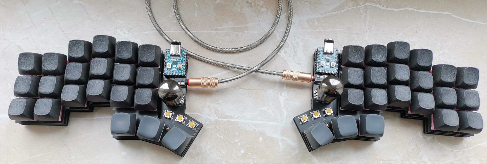

# narfkb2

More pictures in the `pictures` directory.

## Attention

I'm a hobbyist/amateur at best. So there may be things that aren't optimized. That being said I've had the files
in the `gerbers/` directory manufactured at JLC with 1.6mm size and they work just fine with my fork of the qmk repository
directory. So if you decide to use this, then please be advised that I'm not providing any sort of liability and you should
exercise some caution.

## BOM

| Quantity  | Item                               | Comment                  |
| --------- | ---------------------------------- | ------------------------ |
| 2         | Waveshare RP2040-Zero              |                          |
| 2         | IC-Sockets for MCU                 | Optional but recommended |
| 2         | TRRS Sockets                       |                          |
| 50        | 1N4148 SOD123 diodes               |                          |
| 42        | MX Hotswap Sockets                 |                          |
| 2         | EC11 Encoders                      |                          |
| 6         | Omrom 6mm Tact switches            | B3F-1002                 |
| 42        | MX Switches + Keycaps              |                          |
| 12        | M2 Screws, Nuts, Bolts and Spacers |                          |

## Firmware

See [my fork](https://github.com/sebastian-stumpf/qmk_firmware/tree/sepp/keyboards/narfkb2) of the qmk repository. Nothing special here.
You can just copy the code over to your own repository.

## Feedback

I'm always happy to hear your opinions about this and if you decide to build this board then please do send me a picture of it.
